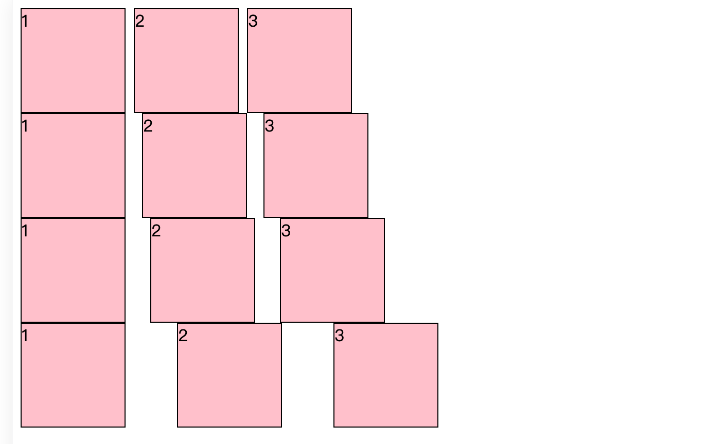

# Space 组件

## 依赖安装

```tsx
pnmp i
```

## 启动项目

```tsx
pnpm start
```

## 基本用法

**1.相邻组件水平距离**

```tsx
import Space from "@/Space";
import "./index.css";
export default function HomePage() {
  return (
    <div>
      <Space>
        <div className="box">1</div>
        <div className="box">2</div>
        <div className="box">3</div>
      </Space>
    </div>
  );
}
```

展示图片


**2.垂直距离**

```tsx
import Space from "@/Space";
import "./index.css";
export default function HomePage() {
  return (
    <div>
      <Space direction="vertical">
        <div className="box">1</div>
        <div className="box">2</div>
        <div className="box">3</div>
      </Space>
    </div>
  );
}
```

展示图片


**3.间距大小**
设定三种间距大小，分别为 small、middle、large，默认为 small

```tsx
import Space from "@/Space";
import "./index.css";
export default function HomePage() {
  return (
    <div>
      <Space direction="horizontal" size="small">
        <div className="box">1</div>
        <div className="box">2</div>
        <div className="box">3</div>
      </Space>
      <Space direction="horizontal" size="middle">
        <div className="box">1</div>
        <div className="box">2</div>
        <div className="box">3</div>
      </Space>
      <Space direction="horizontal" size="large">
        <div className="box">1</div>
        <div className="box">2</div>
        <div className="box">3</div>
      </Space>
      <Space direction="horizontal" size={50}>
        <div className="box">1</div>
        <div className="box">2</div>
        <div className="box">3</div>
      </Space>
    </div>
  );
}
```

展示图片


**4.对齐方式**

```tsx
import Space from "@/Space";
import "./index.css";
export default function HomePage() {
  return (
    <div>
      <div className="space-align-box">
        <Space direction="horizontal" align="center">
          center
          <div className="box">1</div>
          <span className="space-align-span">span</span>
        </Space>
      </div>
      <div className="space-align-box">
        <Space direction="horizontal" align="start">
          start
          <div className="box">1</div>
          <span className="space-align-span">span</span>
        </Space>
      </div>
      <div className="space-align-box">
        <Space direction="horizontal" align="end">
          end
          <div className="box">1</div>
          <span className="space-align-span">span</span>
        </Space>
      </div>
      <div className="space-align-box">
        <Space direction="horizontal" align="baseline">
          baseline
          <div className="box">1</div>
          <span className="space-align-span">span</span>
        </Space>
      </div>
    </div>
  );
}
```

图片展示


**5.分裂样式**

```tsx
import Space from "@/Space";
import "./index.css";
export default function HomePage() {
  return (
    <div>
      <Space
        direction="horizontal"
        align="center"
        split={
          <div
            className="split"
            style={{ width: "20px", height: "50px", backgroundColor: "black" }}
          ></div>
        }
      >
        <div className="box">1</div>
        <div className="box">2</div>
        <div className="box">3</div>
        <div className="box">4</div>
      </Space>
    </div>
  );
}
```

展示图片


# 参数说明

| 参数      | 说明                                   |                          类型                          | 默认值     |
| :-------- | :------------------------------------- | :----------------------------------------------------: | :--------- |
| direction | 间距方向                               |                `vertical \| horizontal`                | horizontal |
| size      | 间距大小                               | `"small" \| "middle" \| "large"\| number \| undefined` | `"small"`  |
| align     | 对齐方式                               |      `"start" \| "end" \| "center" \| "baseline"`      | -          |
| wrap      | 是否自动换行，仅在 `horizontal` 时有效 |                        boolean                         | false      |
| className | class 名称                             |                         string                         | -          |
| style     | 样式                                   |                  React.CSSProperties                   | -          |
| split     | 分裂样式                               |                    React.ReactNode                     | -          |
